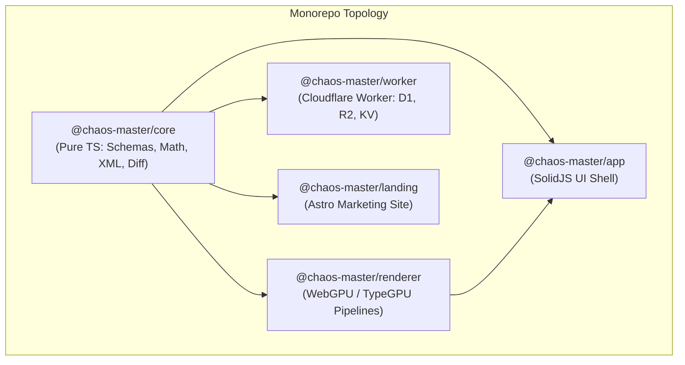
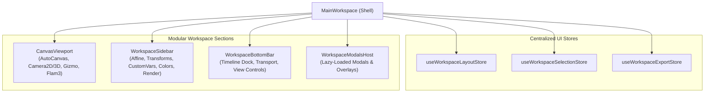

# Lumen Apeiron (chaos-master) — Architectural Refactoring and Improvement Strategy

## Overview

Lumen Apeiron is a browser-native fractal flame generator, animator, and benchmark laboratory powered by WebGPU, TypeGPU, and SolidJS. The codebase combines deep mathematical foundations (140+ 2D/3D variations), real-time WebGPU compute pipelines, Web Audio FFT reactivity, spatial sonification, WebCodecs video export, deterministic session recording/replay, and a suite of WebMCP agent tools (34 at `v0.9.11`, 44 at `9fc08078`).

This document establishes a technical roadmap to address accumulated technical debt, eliminate god components, optimize critical-path startup latency, enforce clean monorepo boundaries, and prepare the platform for future capabilities (such as multi-layer compositing, temporal motion blur, and HDR export) while strictly respecting the hackathon freeze (no remote git pushes, no opened PRs, zero destructive actions).

---

## Codebase Diagnostics and Health Baseline

### Quantitative Metrics

The table this strategy was written against, re-measured on 2026-09-23 (WP4).
Two of its numbers were wrong at `v0.9.11`, the tag it describes: the tool
count and the test-file count. The corrected values are below, with the tree
at `9fc08078` (main after #108) beside them. Every value names how it was
counted, so it can be counted again.

| Metric                   | Originally stated                 | `v0.9.11`, re-measured                        | `9fc08078`                                                               | How it is counted                                                                      |
| :----------------------- | :-------------------------------- | :-------------------------------------------- | :----------------------------------------------------------------------- | :------------------------------------------------------------------------------------- |
| **Source files**         | 1,305 (1,132 TS, 110 CSS, 60 SVG) | 1,163 TS/TSX, 111 CSS, 61 SVG                 | 1,513 TS/TSX, 122 CSS, 69 SVG                                            | `git ls-tree -r --name-only <rev> packages`, by extension; tests included              |
| **TypeScript lines**     | 193,873 (all source)              | 163,963 excluding tests, 198,307 including    | 193,585 excluding tests                                                  | `git grep -c '' <rev>` over every `.ts`/`.tsx` under `packages/` (as `wc -l` counts)   |
| **Test suite**           | 219 test files                    | **201** vitest files, plus 4 Playwright specs | 353 vitest files, 4,029 tests; 21 Playwright specs                       | `*.test.ts(x)` under `packages/`; `pnpm test`                                          |
| **Variations catalogue** | 148 variation modules             | 403 2D and 43 3D variation types              | 403 2D and 43 3D variation types                                         | `variationTypes` and `variationTypes3D`, read from the registry in a vitest run        |
| **WebMCP agent tools**   | 39 registered tools               | **34**                                        | 44                                                                       | `allTools` in `webmcp/tools/index.ts`, held to `docs/webmcp.md` by `toolCount.test.ts` |
| **TypeScript health**    | 0 errors at `v0.9.11`             | not re-run                                    | 0 errors (`pnpm typecheck`)                                              |                                                                                        |
| **ESLint health**        | 0 errors, 4 security warnings     | not re-run                                    | 0 errors, 79 warnings (46 complexity, 33 security)                       | `pnpm lint`                                                                            |
| **Formatting status**    | 2 files require formatting        | not re-run                                    | clean (`pnpm fmt`)                                                       |                                                                                        |
| **Largest file**         | `MainWorkspace.tsx` (7,928 lines) | `MainWorkspace.tsx`, 7,928 lines              | `flame/examples/animations.ts`, 5,713 (data); `MainWorkspace.tsx`, 4,546 | `pnpm metrics`                                                                         |

The "148 variation modules" could not be reproduced by any count of files or
registry entries; the registry has held the same 446 types since the tag.
[docs/agent/CODE-HEALTH.md](agent/CODE-HEALTH.md) keeps the current numbers.

---

## Core Pain Points and Technical Debt Inventory

### 1. The Monolithic `MainWorkspace.tsx` (7,928 Lines)

- **Problem**: `packages/app/src/MainWorkspace.tsx` contains 71 `createSignal` declarations, 22 `createEffect` blocks, dozens of inline callbacks, and over 3,100 lines of inline JSX.
- **Consequences**:
  - Severe cognitive overhead when inspecting or modifying layout logic.
  - High compilation and hot-module-replacement (HMR) latency.
  - High risk of regressions: isolated changes frequently introduce unintended type errors or reactive loops (as seen in parallel branches).
  - Tightly couples unrelated domains: canvas rendering, affine coordinate editing, custom WGSL variation compilation, audio reactivity, sonification, timeline keyframing, and 15 distinct modal dialogs.

### 2. Startup Latency and Eager Module Ingestion

- **Problem**:
  - `src/flame/variations/index.ts` statically imports all 140+ variation shader modules and their Valibot schemas, causing Vite to pre-transform hundreds of TypeGPU modules on startup.
  - `MainWorkspace.tsx` eagerly imports heavy modals and panels (e.g. `BenchmarksPage` [2,868 lines], `AudioWiringModal` [1,633 lines], `LogoFaviconGenerator` [1,271 lines], `AncestryTreeModal`, `BreedGallery`, and `DuelStage`).
- **Consequences**: Initial bundle size is inflated, increasing the initial download, parse, and execution time before first canvas paint.

### 3. Leaky Monorepo Boundaries

- **Problem**: `packages/app` houses the browser frontend, the Cloudflare Worker backend (`src/worker/index.ts` - 1,289 lines), and node-based CLI administration scripts (`scripts/gallery-admin.mjs` - 91 KB).
- **Consequences**: The Worker backend imports schemas directly from frontend directory paths (`@/flame/schema/flameSchema`). This impedes independent testing, deployment, and optimization of the backend service.

### 4. Entangled WebGPU Pipeline and Lifecycle in `Flam3.tsx`

- **Problem**: `Flam3.tsx` (1,454 lines) simultaneously coordinates WebGPU device acquisition, interactive rAF render loops, a custom self-scheduling async export driver, post-processing pipelines (adaptive blur, density estimation, color grading), and camera contexts.
- **Consequences**: Hard to isolate rendering bugs from export bugs. Cross-browser edge cases (e.g. WebGPU device stalls on iOS Safari or buffer allocations in Firefox) are harder to isolate and test.

### 5. Fragmented Reactive State Management

- **Problem**: Over 70 individual signals are declared in `MainWorkspace`, often wired across deeply nested component trees via prop drilling.
- **Consequences**: SolidJS memos instantiated conditionally in props can escape component ownership, leading to memory leaks or orphaned subscriptions. Grouping related state into cohesive Solid stores (`createStore`) is needed.

---

## Target Architecture



### Deconstructed `MainWorkspace` Architecture



---

## Phased Implementation Roadmap

### Phase 0: Baseline Assurance and Safety Net

- **Goal**: Establish safety boundaries without modifying functional code.
- **Actions**:
  1. Fix Prettier formatting divergences in `packages/app/src/webmcp/tools/arcadeTeach.ts` and `packages/landing`.
  2. Verify that all 219 unit and integration tests pass cleanly.
  3. Ensure characterization tests cover critical paths (schema boundaries, flame serialization, affine math).

### Phase 1: Modularization of `MainWorkspace.tsx`

- **Workstream 1.1: `WorkspaceModalsHost.tsx` Extraction**
  - Move the rendering of all secondary dialogs and modals out of `MainWorkspace`:
    - `AncestryTreeModal`, `BenchmarkModal`, `BreedGallery`, `BlendFlameGallery`, `CustomVariationEditor`, `DiffViewModal`, `DiscordShareModal`, `DocumentationModal`, `ExportPngDialog`, `HelpModal`, `ImportVariationsModal`, `LoadFlameModal`, `LogoFaviconGenerator`, `MigrationModal`, `ShareLinkModal`.
  - Wrap non-critical modals in `solid-js` `lazy()` so their code is loaded on demand.
  - Expected line reduction in `MainWorkspace`: ~800 lines of JSX and 40+ imports.

- **Workstream 1.2: `CanvasViewport.tsx` Extraction**
  - Extract the canvas viewport container:
    - AutoCanvas lifecycle, Camera2D / Camera3D bindings, orientation gizmo, render error boundary, canvas screen-reader descriptions, and hover preview badges.
  - Expected line reduction in `MainWorkspace`: ~400 lines.

- **Workstream 1.3: `WorkspaceBottomBar.tsx` Extraction**
  - Extract the bottom bar container:
    - `ViewControls`, timeline container, timeline resize drag handler, playback status bar, and audio reactivity toggle.
  - Expected line reduction in `MainWorkspace`: ~300 lines.

- **Workstream 1.4: `WorkspaceSidebar.tsx` Sub-Component Breakdown**
  - Decompose the 2,500+ line sidebar into focused functional sections:
    - `AffineEditorSection.tsx`: Pre-affine and post-affine grid/matrix controls.
    - `CustomVariationsSection.tsx`: Saved custom variation library and action buttons.
    - `TransformsSection.tsx`: Transform header toolbar, transform list, variation weights, and parameter sliders.
    - `ColorAndPaletteSection.tsx`: Color map selector and custom palette controls.
    - `RenderSettingsSection.tsx`: Quality presets, density estimation, filtering options.
    - `RandomizerSection.tsx`: Randomize and mutate controls.
  - Expected line reduction in `MainWorkspace`: ~2,500 lines.

- **Workstream 1.5: UI State Encapsulation**
  - Consolidate standalone signals into cohesive Solid stores:
    - `useWorkspaceLayoutStore`: Sidebar open/closed, compact mode, timeline collapsed.
    - `useWorkspaceSelectionStore`: Selected transform ID, selected variation ID, active tabs.
    - `useWorkspaceExportStore`: Dimensions, export quality, active job status.
  - Final result: `MainWorkspace.tsx` reduced from 7,928 lines to a clean shell under 500 lines.

### Phase 2: Code Splitting and Startup Optimization

- **Workstream 2.1: Dynamic Loading of Variations**
  - Split the 140+ variations into core (essential classic variations) and extended (specialized parametric/3D variations).
  - Dynamically import parameter editor UI components (`getParamsEditor`) on demand when a variation is selected, rather than loading all editor bundles on startup.
- **Workstream 2.2: Visibility-Gated GPU Canvases**
  - Enforce the `gallery_preview_layout` pattern across all preview galleries (`QuickVariationPicker`, `VariationSelector`, `FlameRandomizerCard`, `BreedGallery`).
  - Ensure offscreen items mount DOM placeholders and only instantiate WebGPU canvases when scrolled into view.

### Phase 3: WebGPU and TypeGPU Renderer Decoupling (`Flam3.tsx`)

- **Workstream 3.1: Render Loop Separation**
  - Extract interactive rAF loop logic into `createInteractiveRenderDriver.ts`.
  - Extract self-scheduling export loop into `createExportRenderDriver.ts`.
  - Leave `Flam3.tsx` focused on GPU context management and resource binding.
- **Workstream 3.2: Error Recovery and Parity**
  - Align 2D and 3D pipeline error handling: ensure pipeline dispatch failures route consistently through `GPUDevice.lost` recovery rather than silent failure.
  - Standardize numeric guards (`EPS`, `safeDenom`) across all variations.

### Phase 4: Cloudflare Worker Backend Refactoring

- **Workstream 4.1: Route and Middleware Decomposition**
  - Decompose `packages/app/src/worker/index.ts` (1,289 lines) into:
    - `src/routes/shorten.ts`: URL shortening and retrieval (KV).
    - `src/routes/og.ts`: Social card generation and R2 storage.
    - `src/routes/gallery.ts`: Community showcase queries and submissions (D1).
    - `src/routes/discord.ts`: Discord webhook relay.
    - `src/middleware/rateLimit.ts`: Per-IP rate limiting.
    - `src/middleware/turnstile.ts`: Cloudflare Turnstile token validation.
  - Wire via a lightweight router.

### Phase 5: Monorepo Package Extraction (`@chaos-master/core`)

- **Workstream 5.1: Pure Core Package**
  - Create `packages/core` containing:
    - Flame schemas and Valibot validation logic (`flameSchema.ts`).
    - Timeline schema and interpolation math.
    - Affine transformation matrices and 2D/3D math.
    - `.flame` XML parser and serializer.
    - Flame diffing and fitness scoring algorithms.
  - Remove all DOM and SolidJS dependencies from this layer.
  - Enable frontend, worker, and CLI scripts to import `@chaos-master/core` cleanly.

### Phase 6: Next-Generation Feature Advancements

- **Workstream 6.1: Multi-Layer Flame Compositing**
  - Extend `FlameDescriptor` schema with optional layers array and blend modes (add, multiply, screen, overlay).
  - Modify TypeGPU IFS render pass to accumulate multiple layers into distinct buffers before composite blit.
- **Workstream 6.2: Temporal Anti-Aliasing & Motion Blur**
  - Implement sub-frame accumulation during video export to produce smooth motion blur for high-speed parameter animations.
- **Workstream 6.3: HDR / 32-Bit Float Export Pipeline**
  - Add half-float (`rgba16float`) and 32-bit float output pipeline support for 16-bit PNG or EXR export.

---

## Risk Assessment and Mitigation Matrix

| Risk                                    | Impact   | Probability | Mitigation Strategy                                                                                                       |
| :-------------------------------------- | :------- | :---------- | :------------------------------------------------------------------------------------------------------------------------ |
| **Reactive Tracking Regressions**       | High     | Medium      | Keep prop interfaces identical; verify Solid reactivity with targeted component tests before and after extraction.        |
| **WebGPU Shader Codegen Failure**       | High     | Low         | Run `pnpm validate-wgsl` and `ifsPipeline.resolveAll.test.ts` (validates all 446 variation combinations) on every change. |
| **Hackathon Disruption / Remote Drift** | Critical | Low         | Zero remote pushes, zero PRs. All work kept strictly local in dedicated worktrees or dotfiles.                            |
| **Worker Schema Divergence**            | Medium   | Low         | Maintain shared schema contracts in `@chaos-master/core` with unit validation tests.                                      |
| **Memory Leaks in WebGPU Canvases**     | High     | Medium      | Enforce strict canvas unmounting and queue draining when modals and galleries close.                                      |

---

## Verification Plan

### Automated Test Gates

```bash
# 1. Typecheck full workspace
pnpm typecheck

# 2. Linting and static analysis
pnpm lint

# 3. Formatting verification
pnpm fmt

# 4. WGSL reserved words and schema check
pnpm validate-wgsl

# 5. Vitest unit and integration suite
pnpm test
```

### Characterization and Regression Checks

- Run `ifsPipeline.resolveAll.test.ts` to guarantee that all 2D and 3D variations compile to valid WGSL.
- Run `flameXml.test.ts` to ensure compatibility with flam3 XML import/export.
- Run `playwright test tests/smoke.ci.spec.ts` to confirm no console errors occur during interactive navigation, canvas resizing, and preset changes.
