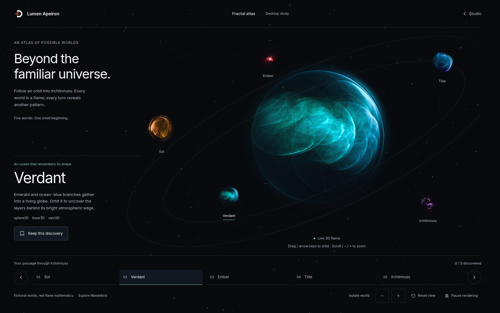

# Desktop fractal atlas

The `/explore-vr` prototype is the first visual slice of the Irchiinnuss universe
idea. It runs in the existing Solid app and renders the selected world using
the existing TypeGPU/WebGPU 3D flame pipeline. It does not start a WebXR session.

## Try it

Open `/explore-vr`, or use **Explore VR** in the desktop studio's version menu.
Select a satellite or a name along the bottom itinerary. Drag the large world
to orbit; scroll or tap the minus/plus controls to zoom. Focus its canvas for arrow-key orbiting and `+`/`-`
zoom. Reset restores the original framing. Pause freezes refinement and camera
input. Isolate hides the satellite controls and orbital guides; the linear
itinerary remains available.

**Keep this discovery** records the selected world's ID in localStorage on the
current device. It is a personal bookmark, not an account, collectible economy,
or claim of completing a game. If storage is blocked, the page explains that
the log lasts only for the current visit. The fragment, such as `#verdant`,
reopens the selected world; camera positions are not persisted.

## Rendering boundary

- `orbPresets.ts` contains five authored 3D flame recipes and their inspection
  descriptions. These are fictional worlds with actual variation names.
- `FlameOrb.tsx` owns one GPU root, a compute gate, the selected canvas, and
  camera signals independent of editor state/history. Sampling refines a
  monoscopic image and stops at its quality budget. Camera changes restart
  accumulation. It pauses when hidden, off screen, or explicitly paused.
- The large specimen is live. Satellite and unavailable-GPU images are captures
  of those same recipes. AI concept images are separate planning materials.
- The star field is a static Canvas2D drawing, repainted on resize. Orbital
  guides and controls are CSS/HTML. There is no per-satellite GPU renderer.
- Entry routing follows the app's standalone-page mechanism, including static
  `explore-vr/index.html` output and Worker canonical slash redirects.

This preview explores appearance and input. It does not provide stereoscopy,
headset tracking, hand tracking, physics, entering a fractal, arbitrary-depth
zoom, combat, or an astronomy simulation. The progressive screen accumulator
must still be evaluated separately for a future stereoscopic renderer.

## Design and next decision

The [surface design](DESIGN.md) follows the user's orb concept and delegated
orbital arrangement. Start with this visual result when deciding whether to
invest in denser flame worlds, a real two-universe journey, and an XR renderer.
The separate personal research pack tracks rules, hardware, architecture
tradeoffs and the user's available 100–300 hours. Weekly allocation and the
eventual headset implementation remain open.

## Verification

Focused tests cover route/static/Worker behavior, menu discovery, page state and
storage failure, preset schema/WGSL resolution, and local camera input. Real
WebGPU verification uses standalone headed Chrome with a hardware adapter;
the repository's configured Playwright suite forces SwiftShader and is not
used as GPU evidence. Phone/tablet checks are browser viewport and touch-input
checks, not physical-device or Quest validation.

Verification on 2026-09-24:

- 132 focused tests passed across seven files. Typecheck, lint, formatting,
  WGSL validation, production build, generated index and citation checks passed.
- Headed Chrome used an AMD RDNA4 WebGPU adapter. All five satellite selections,
  camera controls, discovery state, isolation, no-GPU fallback and studio-menu
  navigation passed with no page or console errors.
- Desktop, tablet and phone layouts were checked; emulated touch dragging and
  button input passed. Chrome and Firefox passed phone layout and selection
  checks. Firefox used the image fallback, so this is not Firefox GPU evidence.
- The preview above is a production-build screenshot, not an AI concept.
